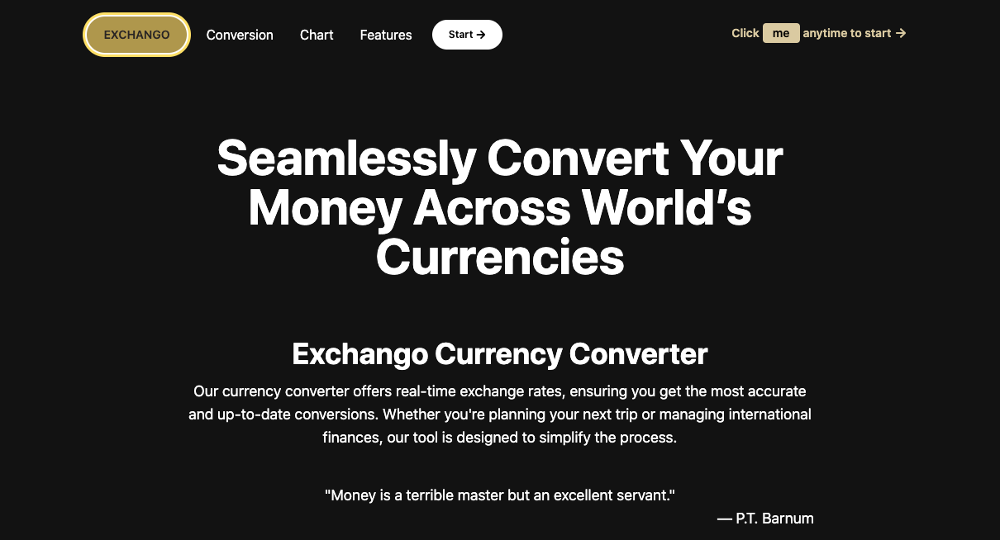
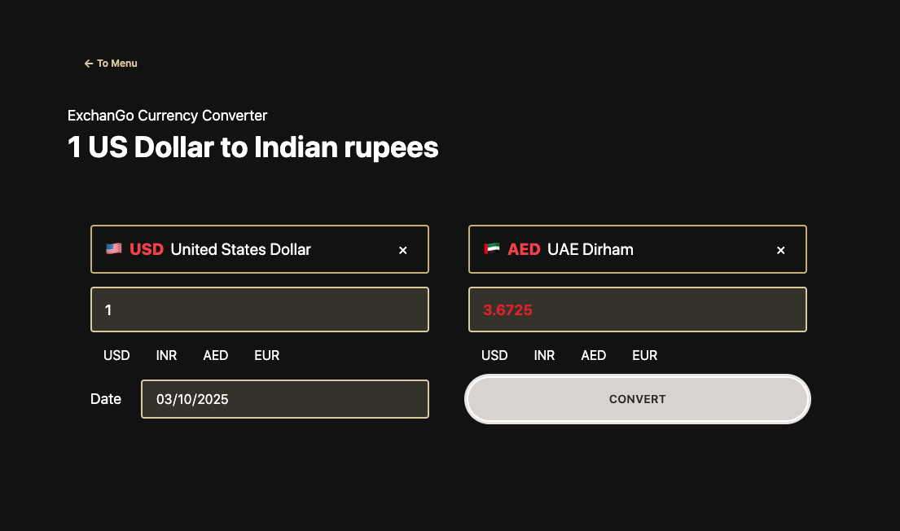
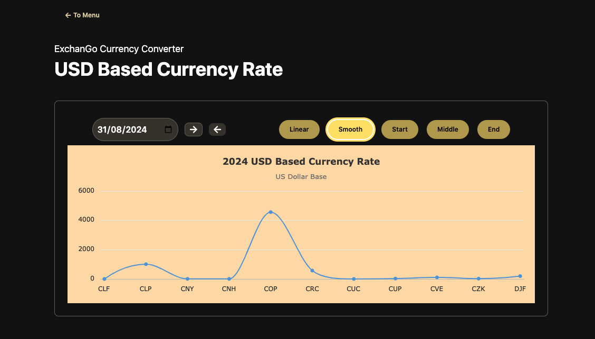
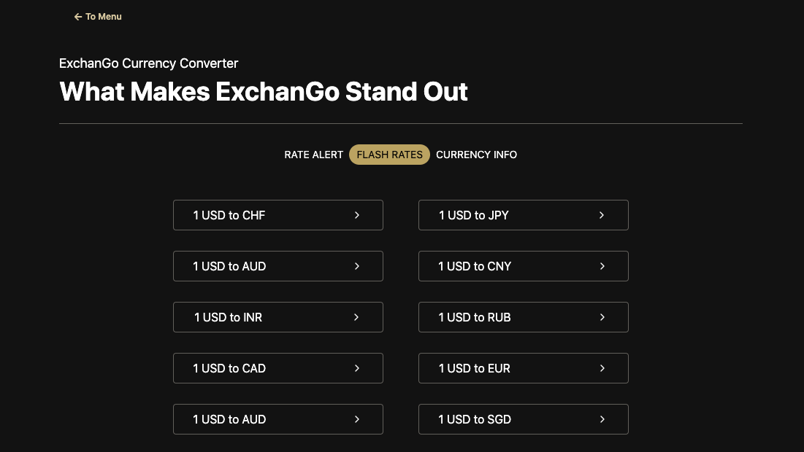
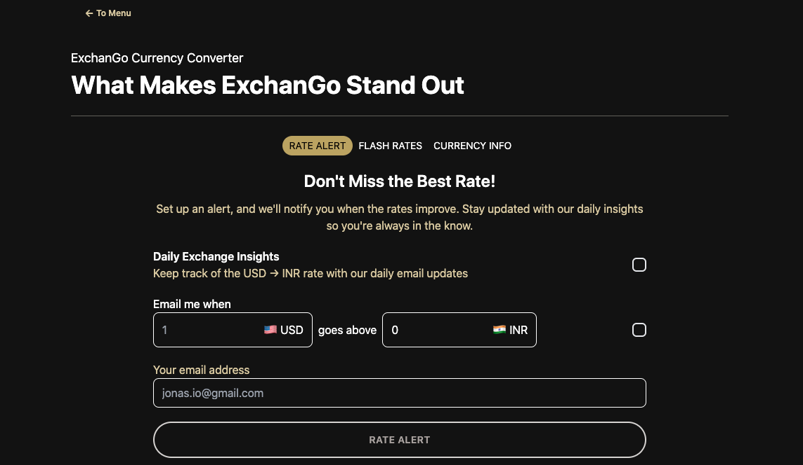
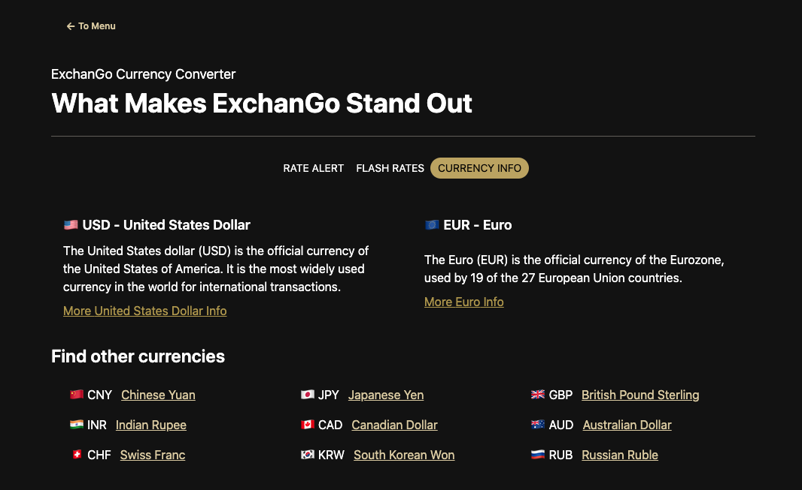

# ExchanGo - Global Currency Converter
[](https://reactjs.org/)
---

## Overview

**ExchanGo** is a sleek, responsive, and user-friendly currency converter app built with React. It allows users to seamlessly convert money between different world currencies with real-time exchange rates. The app offers additional features such as rate alerts, flash rates, and detailed currency info, making it perfect for travelers, businesses, and finance enthusiasts.

---

## Features

- **Real-time currency conversion:** Get accurate and up-to-date exchange rates.
- **From & To Country selectors:** Choose source and target currencies with search and flag display.
- **Conversion history and flash rates:** Quickly access popular and trending currency rates.
- **Rate alert system:** Notify users about specific rate changes.
- **Detailed currency info:** Learn more about each currency, including symbols and summary.
- **Responsive UI:** Mobile-friendly with smooth interactions and animations.
- **Customizable buttons and navigation:** Easy navigation with React Router integration.

---

## Screenshots









---

## Getting Started

### Prerequisites

- Node.js (>=14.x)
- npm or yarn

### Installation

1. Clone the repo

```bash
git clone https://github.com/yourusername/global-currency-converter.git
cd exchango

```
